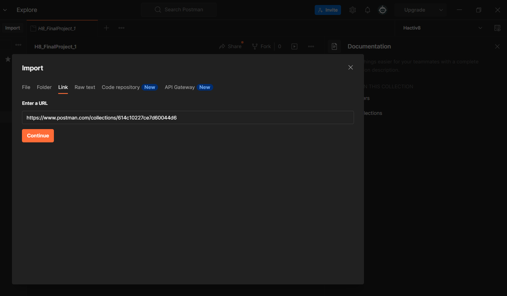

## POSTMAN

[Link to import postman](https://www.getpostman.com/collections/614c10227ce7d60044d6)


```bash
# klik link and copy
# go to postman and import
```

## HOW TO CHECK & SET REMOTE GITHUB ?

```bash
$ git remote -v
# or
$ git remote set-url <remote_name> <remote_url> (ex : git remote set-url origin https://github.com/hafidh2001/Hactiv8_Final_Project-1.git)
```

## HOW TO REMOVE REMOTE GITHUB ?

```bash
$ git remote remove <remote_name> (ex : git remote remove origin)
```

## HOW TO CLONE REPOSITORY ?

```bash
$ git clone <remote_repo> (ex: git clone https://github.com/hafidh2001/Hactiv8_Final_Project-1.git)
# or clones to specific branches
$ git clone -b <branch> <remote_repo> (ex: git clone -b development https://github.com/hafidh2001/Hactiv8_Final_Project-1.git)
```

## HOW TO RUN ?

```bash
$ npm install (to install dependencies on the project stored in package.json)
# step 1 : rename .env.example to .env
# step 2 : fill in the value of each secret variable in .env
```

## DOCUMENTATION

[See more documentaion here](./note.txt)

## License

[MIT LICENSE](./LICENSE)

© Developed by [hafidh2001](https://github.com/hafidh2001)
